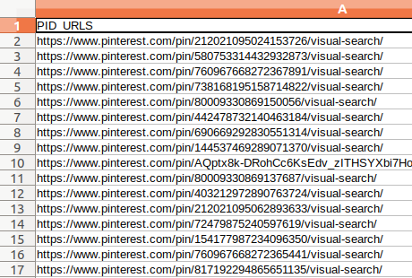
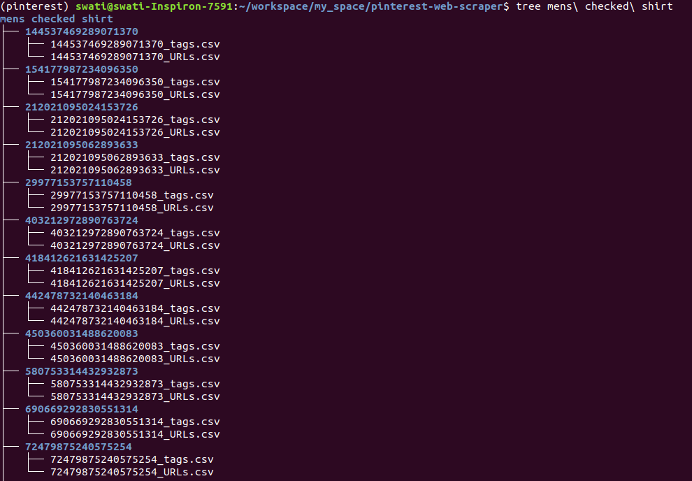

# pinterest-web-scraper
> *"Scraping Visually Similar Images from Pinterest"*


<br>

## Table of Contents
* [Installation](#installation)
* [Usage](#usage)

### Installation
##### 1. Download the repository

Clone the base repository onto your desktop with `git` as follows:
```console
$ git clone https://github.com/SwatiModi/pinterest-web-scraper
```
##### 2. Install necessary dependencies

```console
$ pip install -r requirements.txt
```

### Usage
I have tried a example on query "mens checked shirt" and pushed the resultant csv and folder here in the repo.

##### 1. Search for some product (eg. Black shoes) 
```console
$ python pinterest.py 
```
or pass the search query category as a argument
```console
$ python pinterest.py --category <search query>
```

This will create a CSV of URLs to pins for the given search query



##### 2. Download the visually similar images
```console
$ python dowload_similar_images.py 
```
This script reads all the URLs from the CSV created by previous script. For each pin URL, it downloads the visually similar images and saved in respective folders pin-wise.

This will create a hierarchy of folders and images as follows:


<br>
##### NOTE: 
Web Scraping from many websites is Illegal. <br>
This project is just for Learning and Fun.
